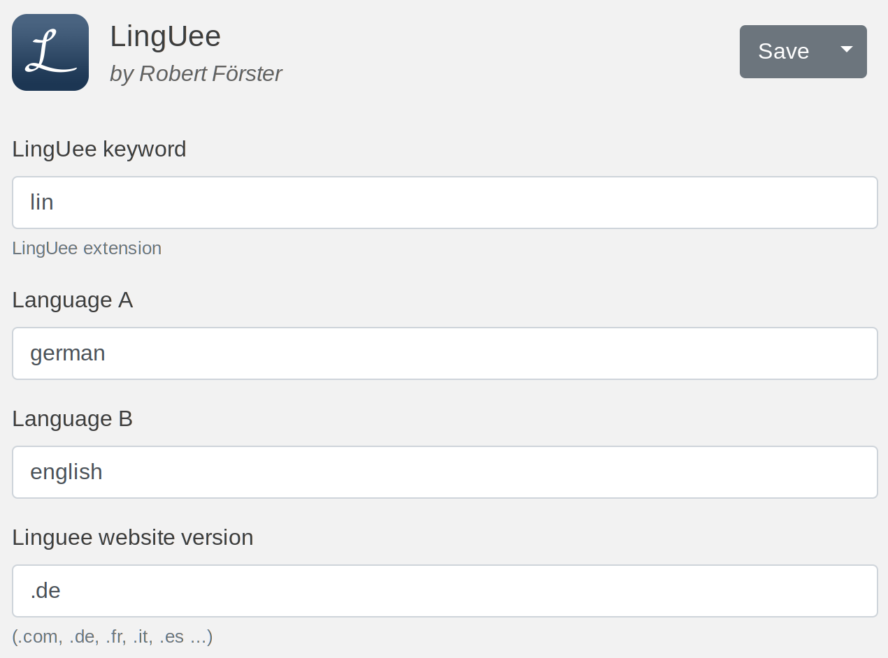

# LingUee

#### Ulauncher - Linguee extension
##### For multi-language-support add $language1-language2 to query. Press enter or click on result to open the page in browser.

##### You can also set the default languages and the default Linguee website from Ulauncher preferences.

